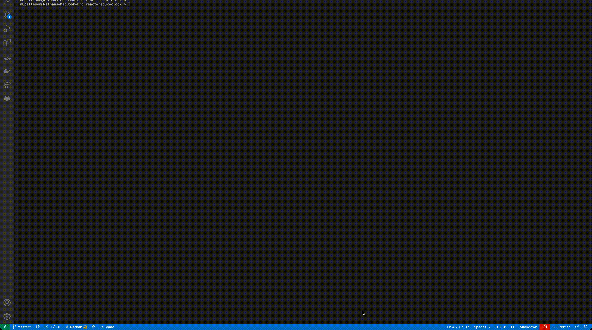

# Basic React/Redux Clock Example

This project creates simple analog clock with react and redux.

---

## Technologies

This project leverages python 3.7.9 with the following packages:

* [React](https://reactjs.org/) - A JavaScript library for building user interfaces

* [Redux](https://redux.js.org/) - A Predictable State Container for JS Apps

* [Surge](https://surge.sh/) - Simple, single-command web publishing. Publish HTML, CSS, and JS for free, without leaving the command line

---

## Installation Guide

Before running the application first install the following dependencies.

Type the following in your termainal where you cloned the repo.

```
  npm install
```

---

## Examples

You can see a live example [here](https://react-redux-clock.surge.sh/)

Type the following in your termainal where you cloned the repo.

```
  npm start
```

Example:



---

## Contributors

Nathan Patterson

Email: nathan.e.patterson@gmail.com

[LinkedIn](https://www.linkedin.com/in/natepatterson/)

[Personal Site](https://www.n8patterson.com)

---

## License

MIT License
Copyright (c) [2021] [Nathan Patterson]

Permission is hereby granted, free of charge, to any person obtaining a copy of this software and associated documentation files (the "Software"), to deal in the Software without restriction, including without limitation the rights to use, copy, modify, merge, publish, distribute, sublicense, and/or sell copies of the Software, and to permit persons to whom the Software is furnished to do so, subject to the following conditions:

The above copyright notice and this permission notice shall be included in all copies or substantial portions of the Software.

THE SOFTWARE IS PROVIDED "AS IS", WITHOUT WARRANTY OF ANY KIND, EXPRESS OR IMPLIED, INCLUDING BUT NOT LIMITED TO THE WARRANTIES OF MERCHANTABILITY, FITNESS FOR A PARTICULAR PURPOSE AND NONINFRINGEMENT. IN NO EVENT SHALL THE AUTHORS OR COPYRIGHT HOLDERS BE LIABLE FOR ANY CLAIM, DAMAGES OR OTHER LIABILITY, WHETHER IN AN ACTION OF CONTRACT, TORT OR OTHERWISE, ARISING FROM, OUT OF OR IN CONNECTION WITH THE SOFTWARE OR THE USE OR OTHER DEALINGS IN THE SOFTWARE.
